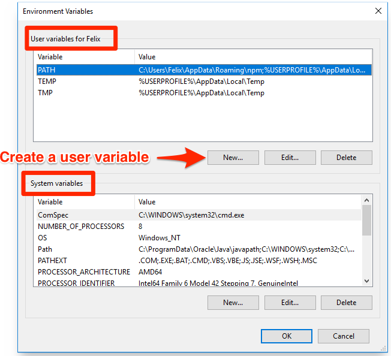
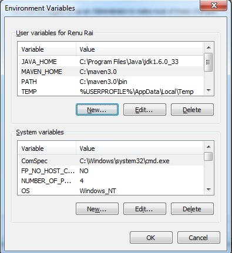

# Setup Java

## Download Java

- ### Looking for Java software Download at [Java](https://www.oracle.com/in/java/technologies/downloads).

## Set the Environment Path

### 1. Open System Properties

- **Windows 10/11:**
  - Right-click on the **Start** menu and select **System**.
  - On the right side, click on **Advanced system settings**.
  - Press **Window Key** and type **Environment Variables** and click on the **Environment Variables** button.
- **Windows 7/8:**
  - Right-click on **Computer** on the desktop or in the Start menu, and then click **Properties**.
  - On the left side, click **Advanced system settings**.

### 2. Access Environment Variables

- In the **System Properties** window, under the **Advanced** tab, click on the **Environment Variables** button.
  

### 3. Edit Environment Variables

- You will see two sections:
  - **User variables for [Your Username]**: These are specific to your user account.
  - **System variables**: These are global and apply to all users.
  - **Select the Sections based on your preferences**: Click **Path**, then Click **New** and Paste the Java path till **bin** folder **For Example: C:\Program Files\Java\jdk1.6.
    0_23\bin**.
    
- To **edit** a variable:
  - Select the variable you want to edit.
  - Click **Edit** to change the variable's name or value.
- To **add a new** variable:

  - Click **New**, and then enter the name as **JAVA_HOME** and value as Java Software directory **For Example: C:\Program Files\Java\jdk-17.6.0**.

    

- To **delete** a variable:
  - Select the variable and click **Delete**.

### 4. Apply Changes

- After making your changes, click **OK** to close the Environment Variables window.
- Click **OK** again to close the System Properties window.

### 5. Verify Changes

- You can verify the changes by opening a new Command Prompt window and typing `java -version`. The Command Prompt will display the version of the Java.
